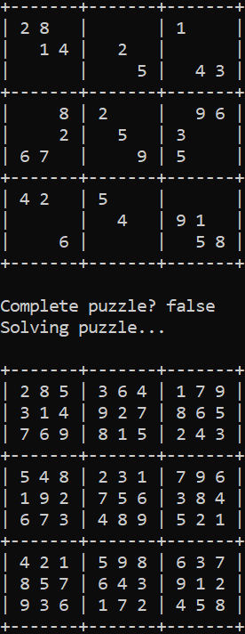

<!-- Simplified version of https://github.com/othneildrew/Best-README-Template -->

<!-- For "back to top" links -->
<a name="readme-top"></a>


<!-- TABLE OF CONTENTS -->
<details>
  <summary>Table of Contents</summary>
  <ol>
    <li><a href="#about-the-project">About The Project</a></li>
    <li><a href="#getting-started">Getting Started</a></li>
    <li>
      <a href="#usage">Usage</a>
      <ul>
        <li><a href="#puzzle-file-format">Puzzle File Format</a></li>
      </ul>
    </li>
    <li><a href="#acknowledgments">Acknowledgments</a></li>
  </ol>
</details>


<!-- ABOUT THE PROJECT -->
## About The Project



This is a simple [sudoku](https://en.wikipedia.org/wiki/Sudoku) solver.
It was an assignment in my Operating Systems course at the University of Washington Bothell,
meant to provide practice writing multithreaded programs.
[`self-assessment.txt`](self-assessment.txt) shows the grading criteria.

<p align="right">(<a href="#readme-top">back to top</a>)</p>


<!-- GETTING STARTED -->
## Getting Started

The program is written in C and uses the pthread library for multithreading.
As a result, it may not work on Windows, and was only intended for use on Linux.

Ensure that you have a C compiler installed (the build script uses [gcc](https://gcc.gnu.org/)).

<p align="right">(<a href="#readme-top">back to top</a>)</p>


<!-- USAGE -->
## Usage

To compile the program, use the build script.
```commandline
./build.sh
```

The resulting program will be called `sudoku`, and accepts the name of a puzzle file as the only command line argument.
```commandline
./sudoku my_puzzle.txt
```

### Puzzle File Format

A puzzle file is a text file representing a sudoku puzzle to be solved.
It must:

* Start with the size of the puzzle (a 9x9 puzzle has a size of 9).
* Be followed by the numbers that make up the puzzle.
* Use 0s to represent empty squares.

Examples of puzzles can be found in the [`puzzles`](puzzles) directory.

<p align="right">(<a href="#readme-top">back to top</a>)</p>


<!-- ACKNOWLEDGMENTS -->
## Acknowledgments

* [README Template](https://github.com/othneildrew/Best-README-Template)

<p align="right">(<a href="#readme-top">back to top</a>)</p>


[solve-screenshot]: images/solve_example.PNG
